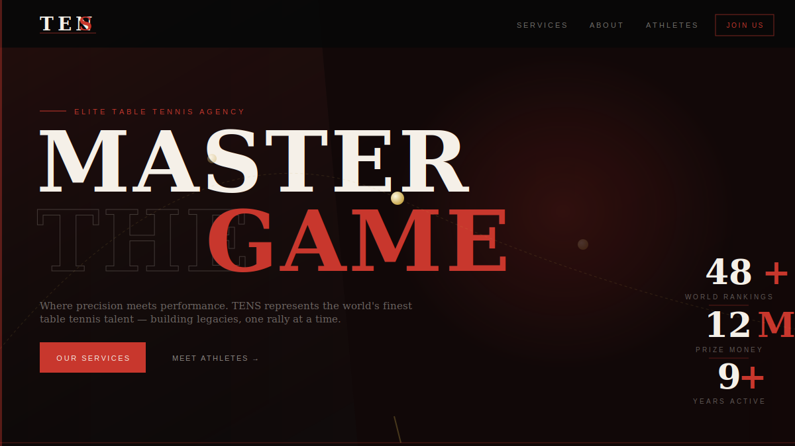
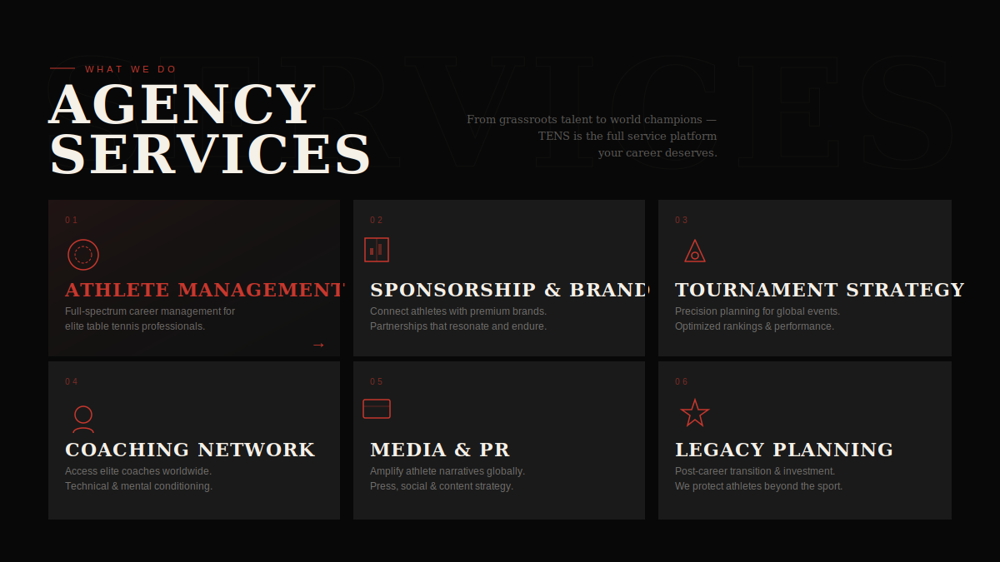
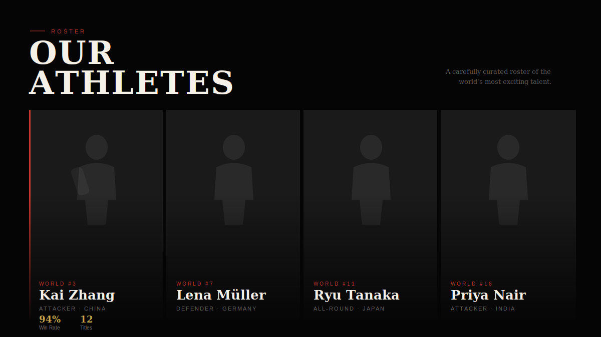

# TENS — Elite Table Tennis Agency

> Premium landing page for a world-class table tennis talent agency.  
> Built with React + Vite, deployed on Vercel.

[](https://react.dev/)
[](https://vite.dev/)
[](https://vercel.com/)
[](https://www.figma.com/design/BCcovJAeYjwYQkazTa7EEC/Table-tensis?node-id=0-1&t=i0vKVmAOVHnLtuTq-1)

**Live Demo:** [https://tensis-agency.vercel.app](https://tensis-agency.vercel.app)  
*(Update this link to your actual Vercel deployment URL if it's different — check your Vercel dashboard for the exact domain.)*

## 📸 Preview

  
  


---

## ✨ Features

- **Animated hero** with physics-based ping pong ball arcs
- **Custom cursor** with trailing ring effect
- **Scroll-triggered reveals** with staggered entrance animations
- **Infinite ticker & dual marquee** rows
- **Hover microinteractions** on every card and button
- **CSS Modules** architecture — zero style conflicts, fully scoped
- **Vercel-ready** with `vercel.json` config included

## 🗂 Project Structure
tens-agency/
├── index.html
├── vite.config.js
├── vercel.json
├── src/
│   ├── main.jsx
│   ├── App.jsx
│   ├── styles/
│   │   └── global.css
│   ├── hooks/
│   │   ├── useCursor.js
│   │   └── useScrollReveal.js
│   ├── assets/
│   │   └── data.js
│   └── components/
│       ├── Cursor.jsx / .module.css
│       ├── Navbar.jsx / .module.css
│       ├── Hero.jsx / .module.css
│       ├── Ticker.jsx / .module.css
│       ├── Services.jsx / .module.css
│       ├── Marquee.jsx / .module.css
│       ├── About.jsx / .module.css
│       ├── Team.jsx / .module.css
│       ├── CTA.jsx / .module.css
│       └── Footer.jsx / .module.css
text## 🚀 Getting Started

```bash
# Install dependencies
npm install

# Start dev server
npm run dev

# Build for production
npm run build
☁️ Deploy to Vercel
Option 1 — Vercel CLI
Bashnpm i -g vercel
vercel
Option 2 — GitHub Integration

Push this repo to GitHub
Go to vercel.com → Import Project
Select your repo — Vercel auto-detects Vite
Click Deploy ✅

🛠 Tech Stack

ToolPurposeReact 18UI frameworkVite 5Build tool & dev serverCSS ModulesScoped component stylingVercelHosting & CI/CD
🐛 Known Issues / Roadmap


#IssueStatusLink1Hero stats overlap on mobile viewports below 768pxOpenIssue #12Add a light mode theme toggleOpenIssue #23Marquee animation desync after switching browser tabsOpenIssue #34Custom cursor div renders but cursor:none causes issues on touch devicesOpenIssue #45Enhancement: add scroll progress bar to navbarOpenIssue #5
Found a bug or have an idea? Open an issue — contributions welcome!
See CONTRIBUTING.md for guidelines.

📁 Built by
XOVATO — Full-Stack Development & UI/UX
Zubair Hussain
